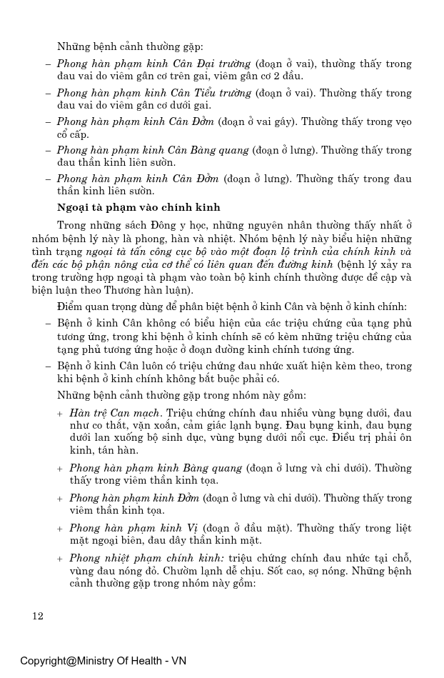
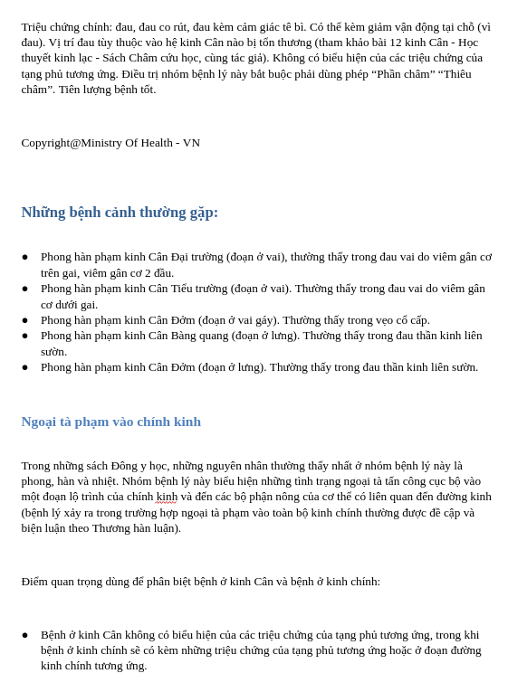

# VLM-Based OCR

## Overview
Processed three scanned Vietnamese traditional medicine books (book1-book3) from page images in `docs/` through the Qwen OCR pipeline to deliver Markdown and DOCX packages under `outputs/`. Each stage of the provided pipeline was executed in sequence so that the final results contain trimmed Markdown, resolved media links, section break markers, and per-book DOCX exports.

## Workflow & Key Steps
1. **Step 1 - `ocr_to_markdown.py`** - Ran Qwen3-VL-8B-Instruct over every page image to produce draft Markdown with inline `FAKE_...png` media placeholders with short Vietnamese captions in `outputs/<book>/markdown_raw/`.
2. **Step 2 - `trim_markdown_raw.py`** - Removed the first 12 prompt/system lines from each raw file so only page content remains.
3. **Step 3 - `materialize_fake_links.py`** - Compared the image captions against the cropped images, stored crops in `outputs/<book>/assets/page_xxxx/`, rewrote Markdown links, and generated the combined `<book>.md` files for each book.
4. **Step 4 - `insert_breaks.py`** - Classified headings inside each `<book>.md` and injected `</break>` markers before `#`/`##` sections.
5. **Step 5 - `markdown_to_docx.py`** - Converted the cleaned Markdown into DOCX files stored in `outputs/<book>/docx/<book>.docx`.

## Tooling & Algorithms
- **Model:** Qwen3-VL-8B-Instruct (`transformers` AutoProcessor + `generate`) for OCR + layout-aware Markdown emission.
- **Frameworks:** Hugging Face Hub, `accelerate`, `safetensors`, `sentencepiece`, `torchvision`, optional `bitsandbytes` for 8-bit loading.
- **Vision QA:** Multilingual CLIP embeddings via `open_clip`'s `xlm-roberta-base-ViT-B-32` / `laion5b_s13b_b90k` checkpoint, ensuring cropped assets stay aligned with Vietnamese captions.
- **Custom scripts:** `ocr_to_markdown.py`, `trim_markdown_raw.py`, `materialize_fake_links.py`, `insert_breaks.py`, `markdown_to_docx.py` (plus utility scripts for bookkeeping).
- **Environment:** Python 3.x virtualenv per `pyproject.toml`, GPU-friendly settings (`device_map="auto"`, FP16/8-bit) to keep throughput acceptable on 24 GB VRAM hardware.

## Data & Output Statistics
| Book | Raw pages (.md) | Clean pages (.md) | Asset crops (.png) |
| --- | ---: | ---: | ---: |
| book1 | 259 | 259 | 1 |
| book2 | 686 | 686 | 118 |
| book3 | 363 | 363 | 33 |
| **Total** | **1,308** | **1,308** | **152** |

## Sample Transformations
**Example 1 - Header trimming (Stage 2)**
- **Before:** [outputs_backup/book2/markdown_raw/page_0001.md](outputs_backup/book2/markdown_raw/page_0001.md) still contains the full system prompt and user instruction noise emitted by Qwen.

```markdown
system
Bạn là trợ lý OCR tiếng Việt...
user
Trang số 0001. Trả về Markdown theo yêu cầu.
assistant
# Cẩm Nang Chăm Sóc Dòng Y


```

- **After:** [outputs/book2/markdown_raw/page_0001.md](outputs/book2/markdown_raw/page_0001.md) retains only the usable Markdown so downstream git diffs and link materialization stay clean.

```markdown
# Cẩm Nang Chăm Sóc Dòng Y


```

**Example 2 - Media link materialization (Stage 3)**
- **Before:** The trimmed raw page above still references synthetic `FAKE_0_0_1000_1000_photo` tokens.
- **After:** [outputs/book2/markdown/page_0001.md](outputs/book2/markdown/page_0001.md) rewrites the link to the real crop created in `outputs/book2/assets/page_0001/` so DOCX exporters embed the right bitmap.

```markdown
# Cẩm Nang Chăm Sóc Dòng Y

[../assets/page_0001/asset_0001_01.png](../assets/page_0001/asset_0001_01.png)
```

**Example 3 - Full Page Screenshots**
- **Raw PDF Page:** 
- **Exported DOCX Page:** 